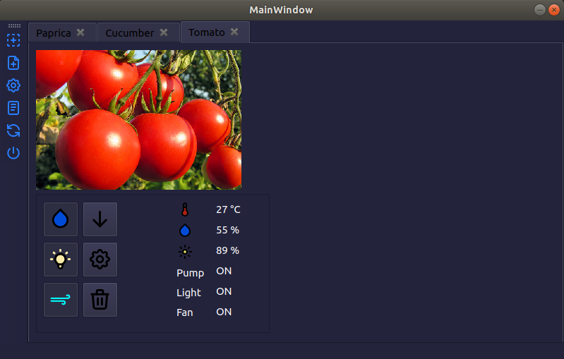
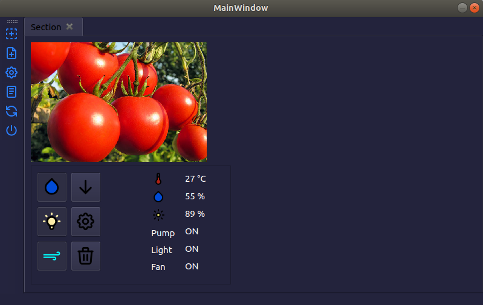
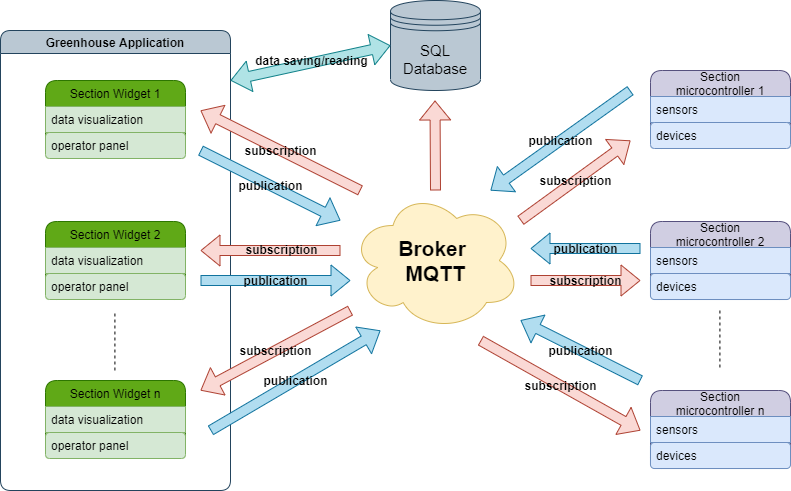
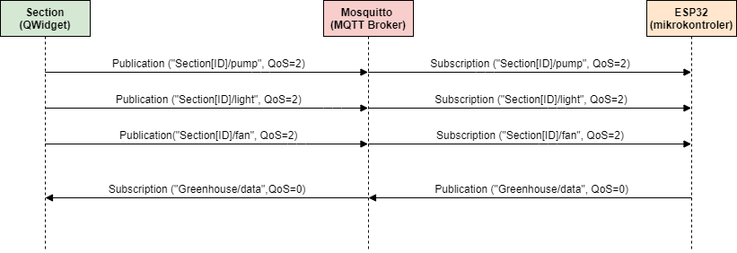
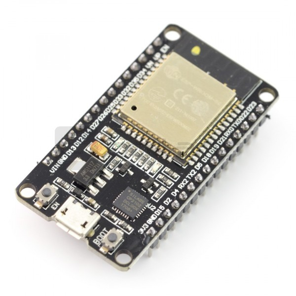

# The project is under development!

# GreenhouseSystem

The project aims to create a scalable and manageable greenhouse control system based on the MQTT protocol. In the system, the user has the ability to manage the sections he defined through a GUI application created using the Qt library. The window size is adapted to the standard Raspberry Pi display.

The system uses the MQTT protocol for communication. The diagram below shows the exchange of messages between Section Widget and ESP32.

Folders in the repository:
- GreenhouseApp - a program written using Qt libraries, thanks to which the user has the ability to control sections,
- GreenhouseSymulator - a simple "Section" simulator that lets you broadcast messages to a broker,
- ProgramESP - program for the ESP32 board enabling sending data from sensors and controlling the pump, lighting and ventilation,
- tests - unit tests to check the functionality of the greenhouse control system,

# Setting up the environment

First install the MQTT broker. I use Mosquitto:
http://www.steves-internet-guide.com/install-mosquitto-linux/

When starting the system, you need to pay attention to the location of the broker in the system. I recommend installing it locally.

You need to run the main application:
- Qt5.12.2 version or later,
- install QMqtt module (look script folder),
- install QChart module,

# Section microcontroller

I used the ESP32 board for direct control of the section. It allows you to wirelessly connect to the network where the broker is located via WiFi.

To download the program to the microcontroller you need:
- Arduino IDE
- ESP32 library https://randomnerdtutorials.com/installing-the-esp32-board-in-arduino-ide-windows-instructions/
- MQTT protocol libraries  https://github.com/knolleary/pubsubclient

If an error pops up during program upload, you must add a capacitor! 
https://randomnerdtutorials.com/solved-failed-to-connect-to-esp32-timed-out-waiting-for-packet-header/

Additionally you need:
- Relay module,
- DS18B20 digital thermometer
- Humidity sensor,
- Insolation sensor,

Because the system is WIP, I replaced the sensors with a potentiometer and photoresistor for testing.

# Quick GreenhouseApp documentation

- Messenger - implementation of the MQTT client using the "Singleton" design pattern. Receives messages from the broker and also allows you to send messages.
- Section - QWidget enabling control of one section,
- SectionSettings - QDialog defining and editing Section settings
- SectionManager - class for managing Sections